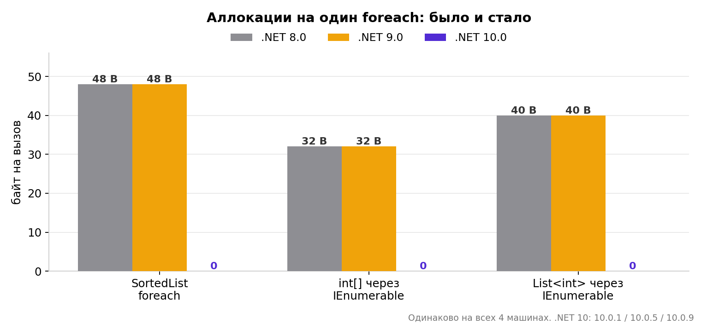
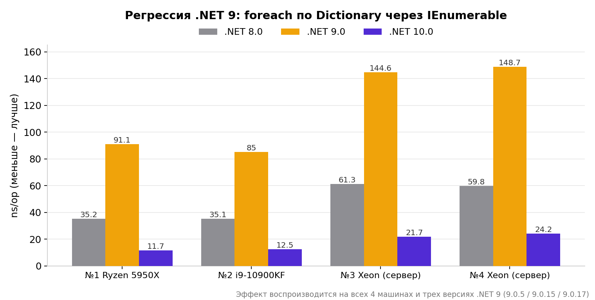
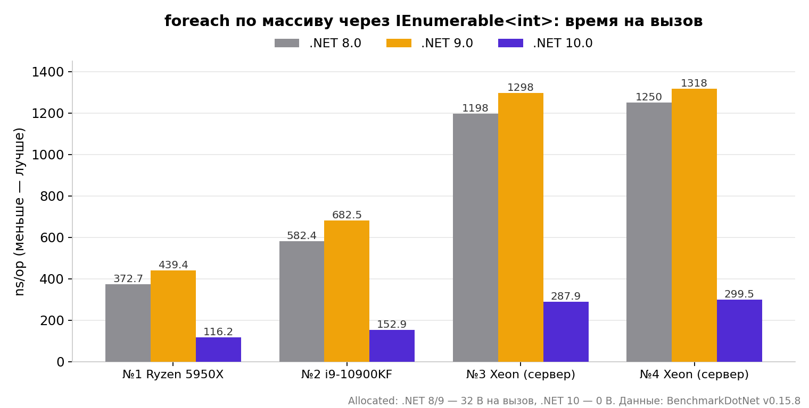

# HiddenEnumerators

Бенчмарки к статье **«Бенчмаркая foreach и энумераторы: аллокации, которые прятались 10 лет»**. Три класса — три истории про скрытые аллокации в обычном `foreach`, прогнанные на .NET 8, 9 и 10 одновременно.

## Что измеряется

| Класс | История | Пруф |
|---|---|---|
| `SortedListVsDictionary` | SortedList аллоцирует энумератор на каждый foreach, Dictionary — нет. Причина — возвращаемый тип GetEnumerator | [dotnet/runtime#81128](https://github.com/dotnet/runtime/issues/81128) |
| `ArrayDeabstraction` | foreach по массиву через IEnumerable: 32 B на .NET 8/9, ноль на .NET 10 | [dotnet/runtime#108913](https://github.com/dotnet/runtime/issues/108913) |
| `ListSizeCliff` | List через IEnumerable на 10 / 1 000 / 1 000 000 элементов: где у оптимизации .NET 10 граница | [Performance Improvements in .NET 10](https://devblogs.microsoft.com/dotnet/performance-improvements-in-net-10/) |

## Результаты

Одинаково на 4 машинах, от десктопов до двухпроцессорных серверов:

- .NET 8/9: 48 B (SortedList), 32 B (массив), 40 B (List) на каждый foreach через интерфейс
- .NET 10: ноль аллокаций везде, включая миллион элементов
- Бонус: воспроизводимая регрессия .NET 9 — Dictionary через IEnumerable в 2.4 раза медленнее, чем на .NET 8







Сырые данные всех прогонов с четырех машин (markdown-таблицы BenchmarkDotNet) — в папке [results](results/).

## Запуск

Нужны SDK .NET 8, 9 и 10 (`dotnet --list-sdks`). Каких нет — удалите из `TargetFrameworks` в csproj и уберите соответствующий атрибут `[SimpleJob]`.

```cmd
dotnet run -c Release -f net10.0
```

Один запуск сам поднимет все три рантайма. Результаты — в `BenchmarkDotNet.Artifacts/results`: markdown-таблицы, csv, сводка `_RECAP.txt` и страница с графиками `_CHARTS.html`.

## Структура

```
Benchmarks/   — три бенчмарк-класса
Reporting/    — сводка, графики, сбор результатов
docs/         — графики для этого README
results/      — сырые результаты прогонов с четырех машин
Program.cs    — запуск всего одной командой
```

## См. также

[DisasmProof](https://github.com/ComboxSoftDeveloper/DisasmProof) — машинный код этих же сценариев через DOTNET_JitDisasm: наглядно видно, куда .NET 10 дел энумератор.
